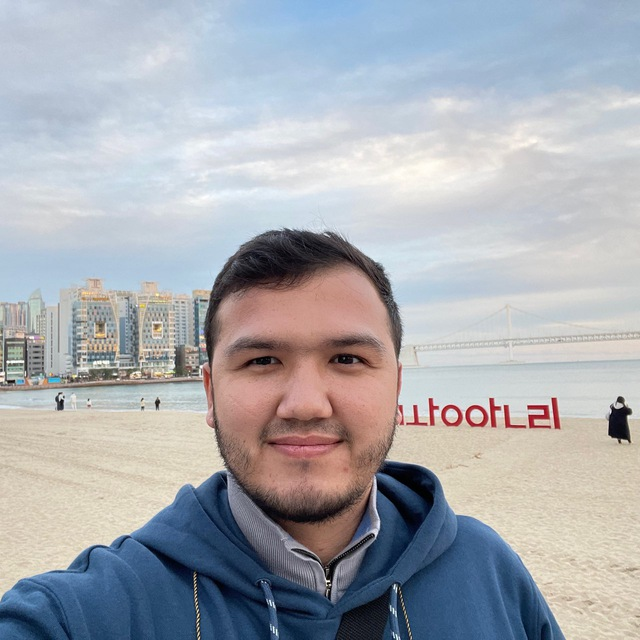

## About Me

Hi! I’m a passionate Software Engineer and a Computer Science degree. 
I specialize in building scalable web applications, constantly learning new technologies, and delivering clean, maintainable code. 
I'm driven by a love for problem-solving and a commitment to lifelong learning.

## Experience

> **Nomadian**, Uzbekistan
- Software Engineer
- January 2024 - Present
- Developing scalable application features, writing clean, efficient code, and ensuring best practices in CI/CD, DevOps, and version control while collaborating on software solutions.

> **Nextree**, South Korea
- Software Engineer
- July 2022 - Present
- Designing medium-complex application features, writing code according to defined coding standards and best practices and following  processes such as code version control, CI/CD DevOps, and other project-specific processes.

> **Netlane Softwares**, United States
- Software Engineer
- Janurary 2022 - June 2022
- Designing, applying engineering principles to software development and providing solutions.

> **CHOWIS**, South Korea
- SQL Developer
- December 2020 - February 2022
- Creating, optimizing SQL statements and ensuring database performance, security, and availability, providing documentation and specs.

> **Raisense**, Uzbekistan
- Backend Developer
- January 2020 - November 2020
- Creating and testing code, debugging programs, and integrating systems with third-party web services.

## Education

> **Inha University in Tashkent**, Uzbekistan
- Backelor of Computer Science
- September 2016 - August 2020
- Grade: 4.12/4.50(%91.6)
